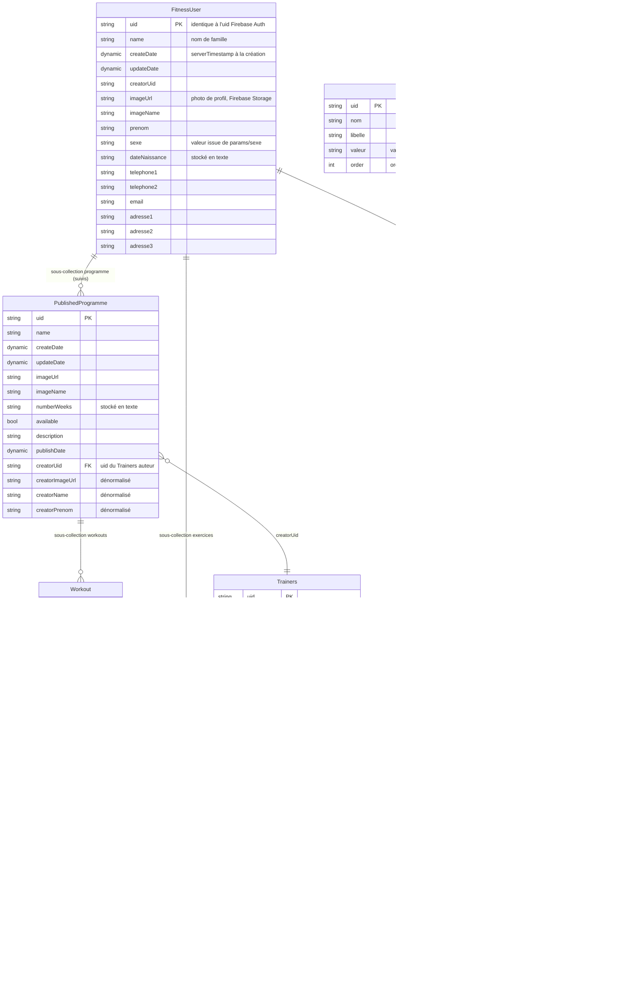

# MCD — modèle de données Fitness-Nc

Modèle conceptuel des données de l'application, reconstitué depuis `lib/domain/`
et les chemins de collections déclarés dans `lib/service/`.

**Firestore n'est pas relationnel.** Il n'y a ni table, ni clé étrangère, ni
jointure : des *collections* de *documents*, éventuellement imbriquées. Le
diagramme ci-dessous les représente comme des entités parce que c'est la façon
la plus lisible de montrer la structure, mais deux nuances comptent :

- une relation `||--o{` entre deux entités est le plus souvent une
  **sous-collection** — une composition, pas une association. Supprimer le parent
  n'efface pas les enfants (Firestore ne cascade pas) ;
- une relation `}o--||` est une **référence logique** portée par un champ `uid…`.
  Rien ne la garantit côté base : c'est au code de la maintenir.

Les attributs listés sont ceux **réellement écrits** dans Firestore, c'est-à-dire
ceux que produit `toJson()` — pas la totalité des champs Dart. Les écarts entre
les deux sont relevés en fin de document.

## Diagramme



## Emplacements Firestore

| Chemin | Entité | Service |
|---|---|---|
| `users/{userUid}` | `FitnessUser` | `FitnessUserService` |
| `users/{userUid}/exercices/{uid}` | `Exercice` | `ExerciceService` |
| `users/{userUid}/workoutInstance/{uid}` | `WorkoutInstance` | `WorkoutInstanceService` |
| `users/{userUid}/workoutInstance/{workoutUid}/userSet/{uid}` | `UserSet` | `UserSetService` |
| `users/{userUid}/programme/{uid}` | `PublishedProgramme` | `FitnessUserService` |
| `users/{userUid}/programme/{programmeUid}/workouts/{uid}` | `Workout` | *(aucun)* |
| `publishedProgrammes/{uid}` | `PublishedProgramme` | `PublishedProgrammeService` |
| `trainers/{uid}` | `Trainers` | `TrainersService` |
| `params/{nomDuParam}/values/{uid}` | `Param` | `ParamService` |

`PublishedProgramme` vit à **deux endroits** : le catalogue public
`publishedProgrammes/`, alimenté par l'application entraîneur, et une copie sous
`users/{uid}/programme/` créée quand l'utilisateur s'inscrit au programme. C'est
la Cloud Function `registerProgram` qui recopie le programme et déplie ses
séances dans `workouts/` ; côté client, seul le désabonnement
(`FitnessUserService.unregister`) touche ces documents, par lot.

`UserSet` est aussi interrogé **hors de sa hiérarchie**, par
`collectionGroup('userSet')` filtré sur `creatorUid` + `uidExercice`
(`UserSetService.getForExercice`) : c'est ce qui alimente les statistiques de
progression par exercice. C'est la raison d'être de `creatorUid` sur cette
entité, et la raison pour laquelle `date` y est recopiée.

## Dénormalisations volontaires

Firestore ne sachant pas joindre, plusieurs attributs sont recopiés pour éviter
une lecture supplémentaire à l'affichage. Ils ne sont **pas resynchronisés** si
la source change.

| Entité | Attributs recopiés | Source |
|---|---|---|
| `UserSet` | `nameExercice`, `typeExercice`, `imageUrlExercice` | `Exercice` |
| `UserSet` | `date` | `WorkoutInstance.date` |
| `PublishedProgramme` | `creatorName`, `creatorPrenom`, `creatorImageUrl` | `Trainers` |

Concrètement : renommer un exercice ne renomme pas les séries déjà enregistrées,
et changer sa photo de profil côté coach ne met pas à jour les programmes déjà
publiés.

## Héritage des domaines

Les entités ne déclarent pas leurs attributs communs : elles en héritent.

```
AbstractDomain              uid, name, createDate, updateDate, creatorUid
├── AbstractStorageDomain   + imageUrl, imageName, storageFile
│   ├── Exercice, FitnessUser, Trainers, Workout, WorkoutInstance
│   └── Programme → PublishedProgramme
└── AbstractSubDomain       + getParentUid()
    └── UserSet
```

`storageFile` (`StorageFile` : `fileBytes`, `fileName`) porte le fichier en cours
d'envoi vers Firebase Storage. Il est annoté `@JsonKey(ignore: true)` : **jamais
persisté**, il ne figure donc pas au diagramme. `Param` et `UserLine`
n'héritent de rien — ce ne sont pas des documents autonomes du modèle métier.

## Écarts entre le modèle déclaré et le modèle écrit

Points relevés en établissant ce document. Ils décrivent l'état du code, ils ne
sont pas corrigés ici.

- **`WorkoutInstance` n'a pas de `toJson` généré** : le sien est écrit à la main
  dans `workout-instance.domain.dart`, et il **omet `creatorUid` et `imageName`**
  que les autres entités écrivent. Les séances ne portent donc pas leur
  propriétaire — c'est leur position sous `users/{uid}/` qui en tient lieu.
- **`Exercice.fromJson` et `FitnessUser.fromJson` sont écrits à la main** et ne
  relisent ni `creatorUid` ni `imageName`, alors que leur `toJson` les écrit. Or
  la mise à jour passe par un `set()` du document entier : un cycle
  lecture → modification → enregistrement remet ces deux champs à `null`.
- **`PublishedProgramme` redéclare `creatorUid`**, déjà porté par
  `AbstractDomain` (`overridden_fields` à `published-programme.domain.dart:22`).
  Un seul champ finit en base, mais la valeur écrite est celle de la
  redéclaration — renseignée par `fromProgramme`, pas par le `create()` du
  service.
- **Deux formats de date coexistent** : `WorkoutInstance.date` est un entier
  (`millisecondsSinceEpoch`), `UserSet.date` une chaîne ISO 8601. Les deux se
  trient correctement dans leurs requêtes respectives, mais ne sont pas
  comparables entre eux.
- **`numberWeeks` et `dateNaissance` sont stockés en texte** alors qu'ils portent
  un nombre et une date.

## Domaines présents dans le code, non écrits par cette application

- **`Workout`** — les séances qui composent un programme suivi. L'application les
  supprime au désabonnement mais ne les lit jamais : aucun service ne les
  expose. Elles sont créées par la Cloud Function `registerProgram`.
- **`Programme`** — classe parente de `PublishedProgramme`, correspondant au
  programme non encore publié. Cette application ne manipule que des programmes
  publiés ; `Programme` n'existe ici que pour porter les attributs communs.

Ces deux domaines appartiennent au modèle de l'application entraîneur
(`olivejp/fitnc-trainer`), dont ce dépôt est indépendant depuis la réintégration
des packages internes. Toute évolution partagée se synchronise manuellement.
